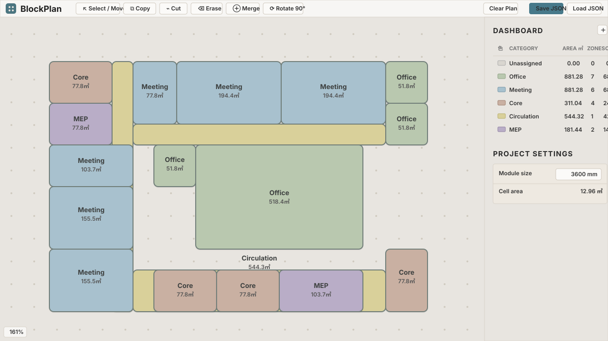

# BlockPlan

BlockPlan is a fast, browser-based architectural zoning and planning tool for early pre-BIM studies. It is not a CAD or BIM replacement; it is meant for quickly sketching planning zones before moving into tools such as Revit.

Public app URL:

https://g00dk0nd0u.github.io/blockplan/

## Sample Workspace



## Basic Usage

Open the public app URL, or open `docs/index.html` directly in a browser.

- Choose a grid module size from the top bar.
- Choose a category and use Paint to draw cells.
- Use Select to select and move connected zones.
- Use Copy to duplicate a selected zone.
- Use Rotate 90° to rotate the selected zone clockwise.
- Use the dashboard to check area, zone count, and cell count.
- Save or load plans as JSON.
- Export the current plan as PNG.

Shortcuts:

- `V` Select / move
- `B` Paint
- `C` Copy
- `R` Rotate selected zone
- `Space` + drag Pan
- Mouse wheel Zoom
- `Delete` / `Backspace` Remove selected zone

## Current Features

- Plain HTML, CSS, and JavaScript
- No npm, build step, or local server required
- HTML Canvas grid planner
- Module selector from 300 mm to 9600 mm
- Editable category names and category colors
- Connected same-category cells treated as zones
- Rounded zone boundary rendering
- Compact dashboard with area, zones, and cells
- Select, move, copy, rotate, and delete zone operations
- JSON save and load
- Auto-save with `localStorage`
- PNG export
- GitHub Pages ready from `main` branch `/docs`

## Browser Support

BlockPlan is designed for current desktop browsers that support HTML Canvas, `localStorage`, and standard file download APIs. Recent versions of Chrome, Edge, Safari, and Firefox are recommended. The app runs entirely in the browser and does not send plan data to a server.

## Review Package

To create a ZIP file of the repository for ChatGPT review:

```bash
python3 user_tools/export_review_package.py
```

The ZIP is written to `output/review_packages/`.

## Data Model

Plans are stored as simple JSON:

```json
{
  "version": 1,
  "moduleSizeMm": 3600,
  "categories": [],
  "cells": {
    "0,0": {
      "categoryId": "office"
    }
  }
}
```

Cells remain the source of truth. Dashboard metrics and connected zones are calculated from the cell map.

## Not Implemented Yet

- Isolate
- Subdivide
- Revit export
- CAD-like precision editing
